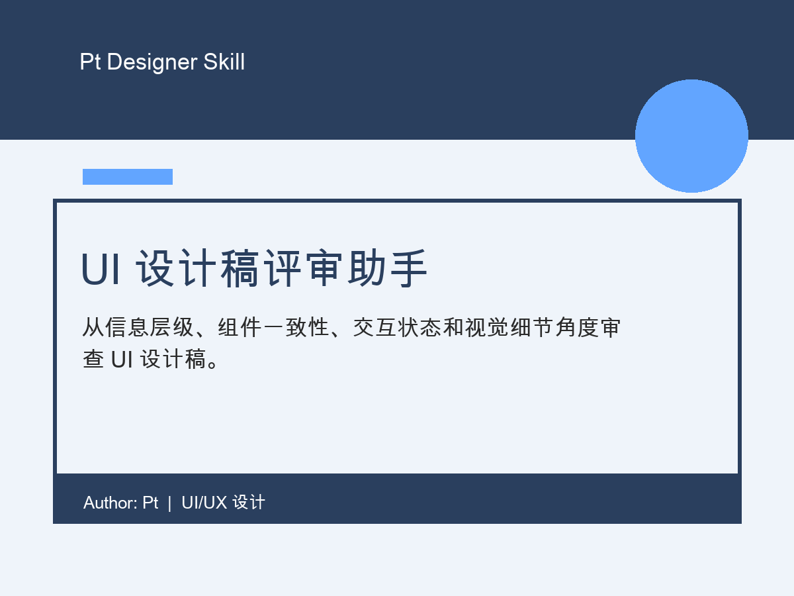

# UI 设计稿评审助手

从信息层级、组件一致性、交互状态和视觉细节角度审查 UI 设计稿。

## 适合谁

UI 设计师、UX 设计师、产品设计师、设计团队负责人

## 适用场景

当你准备交付 UI 设计稿，想检查信息层级、组件一致性、交互状态和视觉细节时使用。

## 输入

产品类型、页面目标、目标用户、设备尺寸、当前设计阶段、重点关注、已知限制、截图或页面说明

## 输出

总体判断、P0-P3 问题清单、逐区块建议、文案优化、交付前检查表

## 在线演示

https://2077zpt-source.github.io/pt-zcool-ui-design-review/

## 文件

- `SKILL.md`: skill 主体文件
- `demo.html`: 说明演示页
- `assets/cover.png`: 4:3 展示封面
- `LICENSE`: MIT License

## 作者

Author: Pt  
License: MIT
